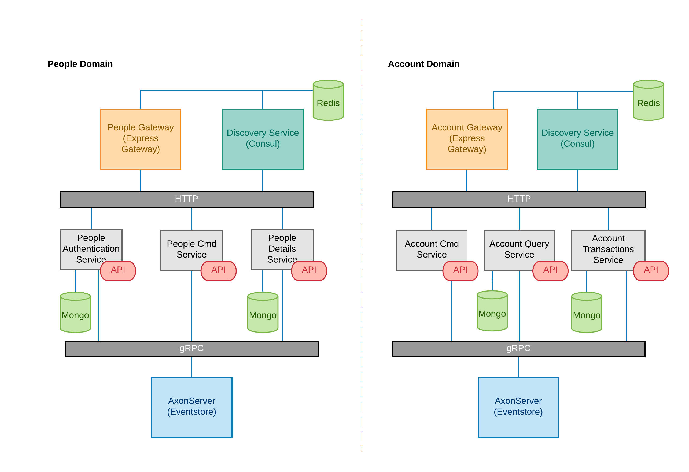
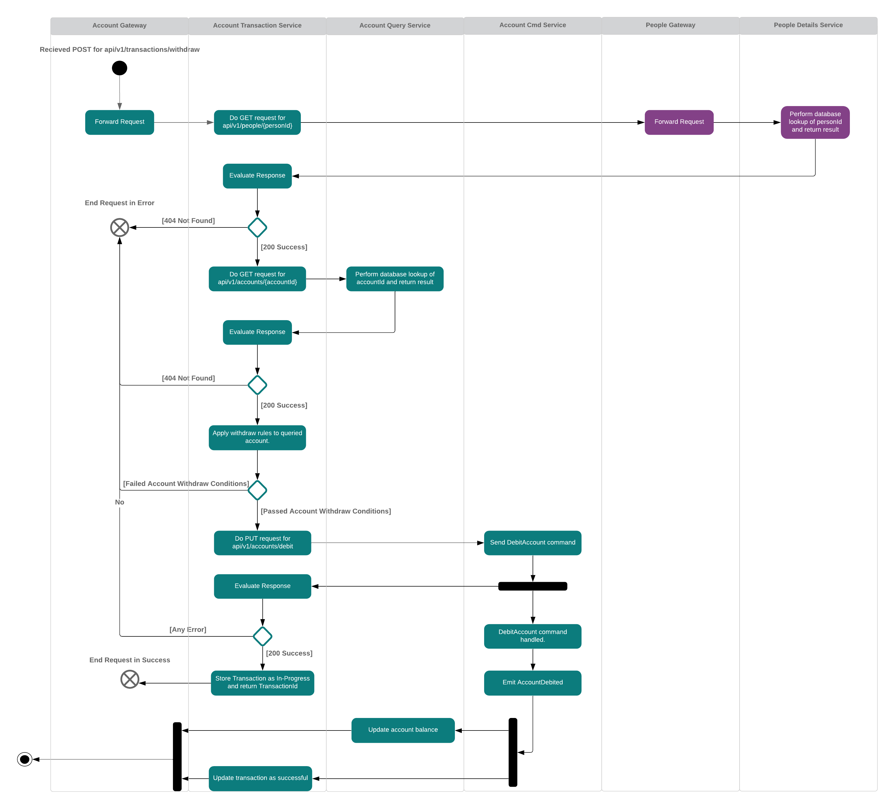
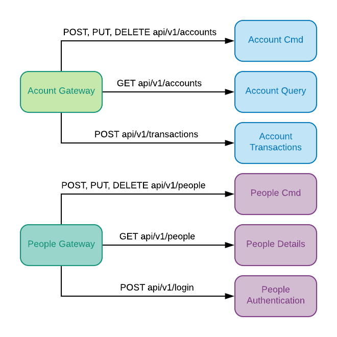
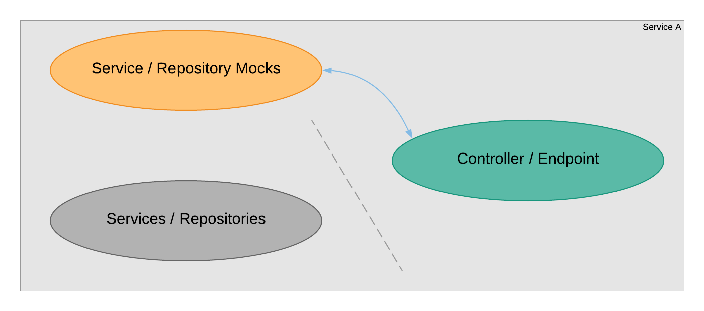
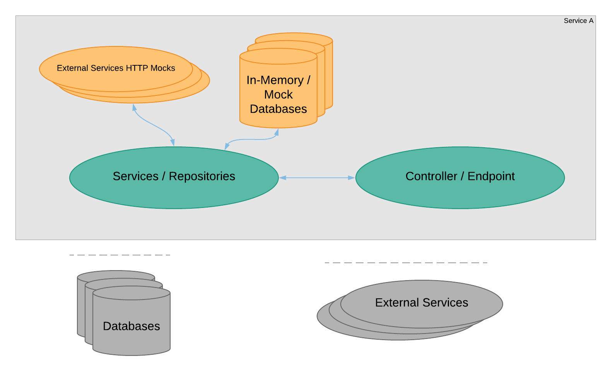
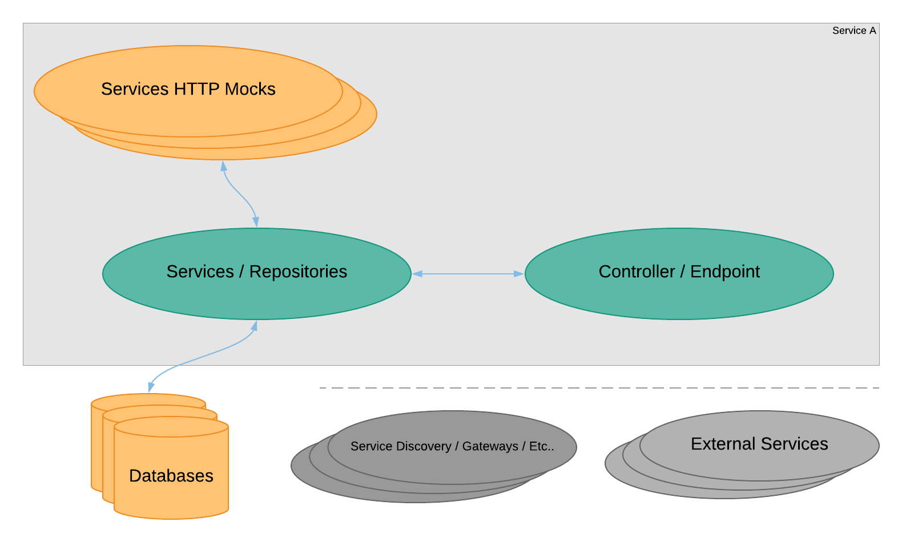
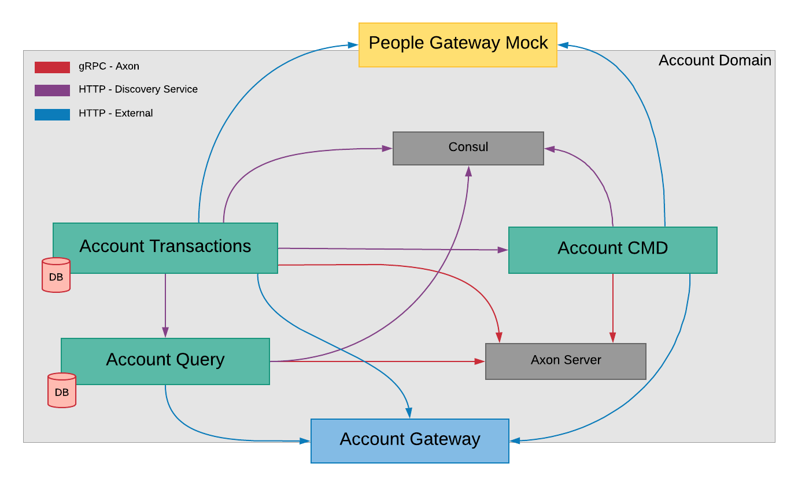
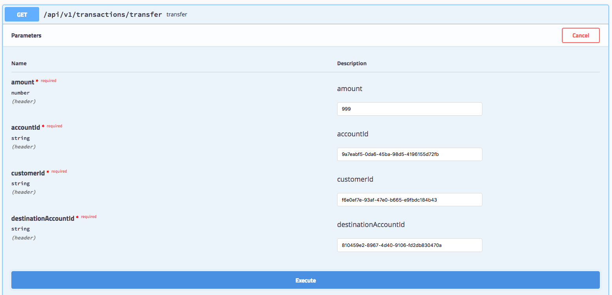

# Banking Microservices Tutorial
[](https://travis-ci.org/AITestingOrg/banking-microservices-tutorial)
[](https://coveralls.io/github/AITestingOrg/banking-microservices-tutorial?branch=service-integration-testing)

The Banking Microservices Example project is a small system used to show how microservices can be implemented and tested with Micronaut, Consul, Tyk, and Axon's Event Sourcing framework. The system can be run in multiple configurations using Docker.


## Architecture

<p style="text-align: center;">The overall Banking Example architecture is broken into two sub-domains, Accounts and People.</p>


<p style="text-align: center;">Example of flow of data after issueing a withdraw command.</p> 


<p style="text-align: center;">Routing configuration of gateways.</p> 

## Configuration
The services can be configured in three ways, a local default configuration under each project resources/application.yml, a development coniguration under
resources/application-dev.yml, and the centralized configuration service. 

## Requirements
See each services readme for detailed requirement information

### Compose
* https://docs.docker.com/compose/install/
* /data/db directory created and accessible to "everyone"

### Java 8
* https://www.oracle.com/technetwork/java/javase/downloads/jdk8-downloads-2133151.html

### Lombok
* IntelliJ IDEA installation: https://projectlombok.org/setup/intellij

# Running the Project

## Start the Microservices
** Build JARs for each project (You will need to build a JAR anytime changes are made to a project, then rebuild either the container or all containers)
```bash
# Assemble the binaries
./gradlew assemble
# Start the backing services: service discovery, configuration, authentication, edge service
docker-compose -f docker-compose-backing.yml up --build
# After the backing services have succesfully loaded, start the domain services
docker-compose up
```

## Start the Microservices with ELK Stack
```bash
# Assemble the binaries
gradle assemble
# Start the backing services: service discovery, configuration, authentication, edge service
docker-compse -f docker-compose-backing.yml up
# While the backing services are starting, start the ELK stack, note you will need to also follow the ELK steps below
docker-compose -f elk/docker-compose.yml up
# Once all the supporting services are loaded, start the domain services configured to log to ELK
docker-compose -f docker-compose-elk.yml up
```

## Stop the Containers
```bash
docker-compose down
docker-compose -f docker-compose-elk.yml down
docker-compose -f docker-compose-backing.yml down

```

## Rebuild Containers
```bash
docker-compose build
```

# Executing Tests

## Windows Users
The following examples use shell scripts, simply replace the `.sh` extentions in the examples with 
`.bat` in order to execute them in Command Prompt or PowerShell.

## Running Unit and Integration Tests
The Gradle task 'test' executes the JUnit tests for each project.
```bash
sh run-unit-tests.sh
```

## Running Code Coverage: Unit and Integration Tests
JaCoCo is used for code coverage and can be run after the unit and integration tests for each service have been executed.
You can find a JaCoCo coverage report under the "coverage" in transaction service after running the unit tests.

## Running Contract Tests
Ideally, these tests would run in a continuous integration system and not require the Docker Compose steps provided.
Start the domain services with internal mocks so that only the endpoints will be tested.

```bash
docker-compose -f docker-compose-internal-mocked.yml up -d
```
Start the PactBroker service and check `http://localhost:8089` that it is live.
```bash
docker-compose -f ./pact-broker/docker-compose.yml up -d
```
Generate the PACTs and execute them. Note, if you have not completed the PACT tests in all the projects then you will see build failures during the first step here, these can be ignored.
```bash
sh ./scripts/generate-publish-pact-tests.sh
sh ./scripts/run-pact-tests.sh
```
Stop the PactBroker.
```bash
docker-compose -f ./pact-broker/docker-compose.yml down
```
Stop the services with internal mocks.
```bash
docker-compose -f docker-compose-internal-mocked.yml down
```

## Running Service Isolation Tests
The documentation [here](documentation/http_stubbed_isolation_tests.md) provides a guide on creating new isolation tests with HTTP stubs.
### Running Service Isolation Tests with All External Dependencies Mocked
Mocking all external dependencies to the services allows for very rapid execution of tests and 
alleviates the need for configuring or utilizing resources for the external dependencies. 
In memory databases are used in the place of Mongo, though the the same Mongo code dependencies 
are used to connect to these in-memory databases. HTTP mock server stubs are used to provide stubbed responses for external services.

Docker is not required to run these tests as all external dependencies are mocked.
```bash
sh isolation-test-mocked.sh
```

### Running Service Isolation Tests with External Databases, Caches, and Etc...
Here only the calls to other services are mocked, but external dependencies like databases, caches, 
and discovery services are deployed. For this guide we will run the Transaction service isolation tests. 
We use Docker Compose to stand up Mongo. Transactions is the only service demoed here because in an actual product you will most likely have a cloud
deployment infrastructure where you can dynamically configure the HTTP stubs, here we simply use a Docker Compose configuration.

Start the services database using the backing services.
```bash
docker-compse -f docker-compose-backing.yml up -d
```
Execute the tests in a new terminal once external dependencies have started.
```bash
sh run-isolation-tests.sh
```
Tear down the external dependencies.
```bash
docker-compose -f docker-compose-backing.yml down
```

If you modify or add an HTTP stub under `./wiremock` then you will need to restart the instances so they refresh their mappings. You can read more about the WireMock API [here](http://wiremock.org/docs/stubbing/).

If you update the WireMock request journal validations under `./transactions/src/tests/resources/wiremock` you will not need to restart the instances, only the tests use these. More documentation on WireMock verification can be found [here](http://wiremock.org/docs/verifying/).

## Running Service Integration Tests

### Sub-Domain Service Integration Testing
To run the sub-domain service integration tests, all of the dependencies must be available for the given service under test. For this case we will be running integration tests for the Account sub-domain, which means that the gateway for the People domain will be mocked, but all Account related services should be up.


Use docker to stand up the supporting services, databases, and etc...
```bash
docker-compose -f docker-compose-sub-domain-testing.yml up
```
Once the services stabilize, you should see a message like `o.a.a.c.AxonServerConnectionManager - Re-subscribing commands and queries`, at this point you can open a new terminal and run the tests.
```bash
sh run-sub-domain-integration-tests.sh
```
Take down the services in the other terminal window.
```bash
docker-compose -f docker-compose-sub-domain-testing.yml down
```

### Pairwise Service Integration Testing
Coming soon...

# API Documentation:

These request can be done using an application like postman or insomnia, directly with curl or using the provided swagger UI.
Go to the [swagger](http://localhost:8082/swagger-ui.html) for the port that personDetails application is running. By default, it is 8082 but it can be changed in the docker-compose files.


From there click on the personDetails-controller drop down, expand the post endpoint and click the try it out button:


Then a body can be provided to make a request to the service, here is an example valid body, feel free to put your name here:
```json
{
     "firstName": "John",
     "id": "f6e0ef7e-93af-47e0-b665-e9fbdc184b43",
     "lastName": "Doe"
}
```

Then click on the execute button


And scroll down to see what the response was:


Now to create some accounts for this user: 

Go to the ui for account-cmd, running on 8089. And open account-controller post [endpoint](http://localhost:8089/swagger-ui.html#/account-controller/addAccountUsingPOST)

Put the previous customerId in the body for the request and execute it. 


The response should have the generated Id for the account just created. 
Copy it somewhere, then execute again and copy the second account id too, both will be used for transactions in a moment.

First quickly check the accounts got created checking the [account query side](http://localhost:8084/swagger-ui.html#/account-controller/getAccountUsingGET)

Check the two account ids against the get endpoint, they return a 200 response with the account info and balances of 0.


Now, making some transactions lets first make a [deposit](http://localhost:8086/swagger-ui.html#/actions-controller/depositUsingGET)

Provide an amount along with the previous obtained ids for account and personDetails. This will respond with a transaction id that is not important for now. 


If the same account is now check on the account query side the balance should shown as the deposited account.

Now, going to the transfer endpoint and making a transaction to pass some of that balance to the other account


Check that the response was a 200 and the balances changed

## Running with Centralized Logging (ELK stack)
To run with centralized logging and logging visualizations follow the steps below.

### Start the ELK stack
* `cd elk`
* `docker-compose up` wait for everything to start
* Check that http://localhost:5601 is accessible in your browser, you can read about configuration Kibana here https://www.elastic.co/guide/en/kibana/4.0/setup.html
* `cd ../`
* `docker-compose up -f docker-compose-elk.yml`
* Refresh Kibana to see the logs.


# Troubleshooting

## Docker Issues
### Orphaned Docker Containers Are Still Running
If you are seeing issues with port allocations and Docker then try running `docker ps`, 
if you see something running that should not be you can kill it with `docker rmi --force <ID>`. 
A useful Docker command for killing all live containers is `docker kill $(docker ps -q)`

### Containers Keep Restarting or Failing
Try increasing your Docker memory, more than 2 CPUs and 4GB assigned to Docker is preferable for this project.

## Trouble Building
### General Build Issues
Try clearing your global Gradle cache by deleting `~/.gradle` and the local `./.gradle` in the project.

### Duplicate class found
Check that you have the proper version of Java installed `java -version`. If it is not 1.8 then set your JAVA_HOME to 1.8.

### IntelliJ can't find getter methods
You are probably missing the Lombok annotation plugin listed in the project requirement section or haven't turned on the annotation processor setting in IntelliJ.

## Tests Issues
### Test Not Running
Check your imports for JUnit, if you don't see juniper for your `Test` annotation then you are using JUNit 4 and the tests won't run until you fix the imports.

### Mocks are Null
Check that you are using Mockito the JUnit 5 way, with the `MockitoExtension` and `ExtendWith` annotations.


### Services are Rehydrated After Restart and Clearing Mongo
If you have a lot of events then services are going to be rehydrated when you bring everything up. To stop this you can delete the event folders `axonserver-eventstore` and `axonserver-controldb` in the root of the project and then bring the environment up.