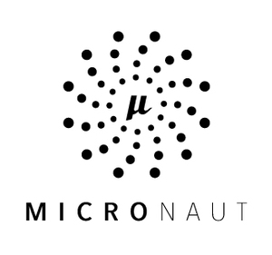
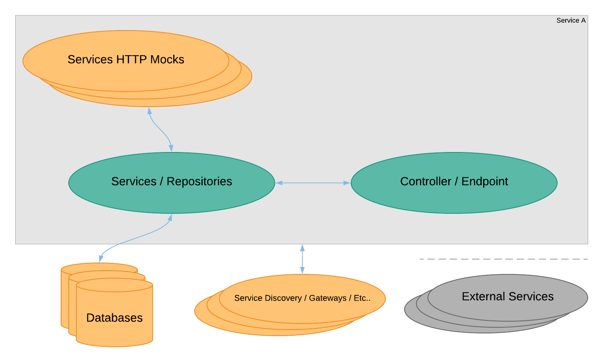
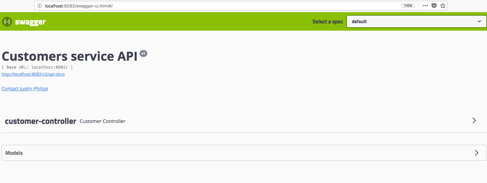
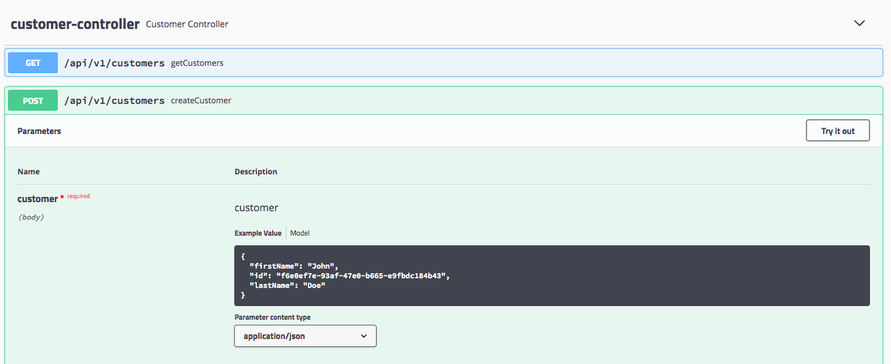
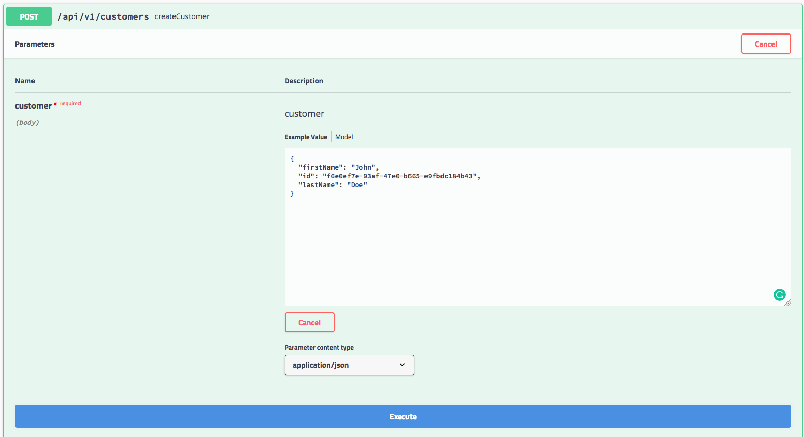
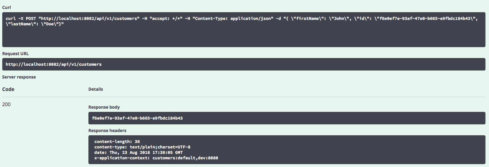
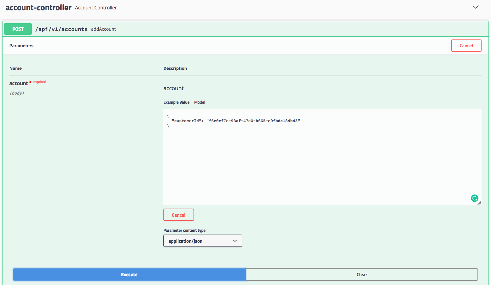
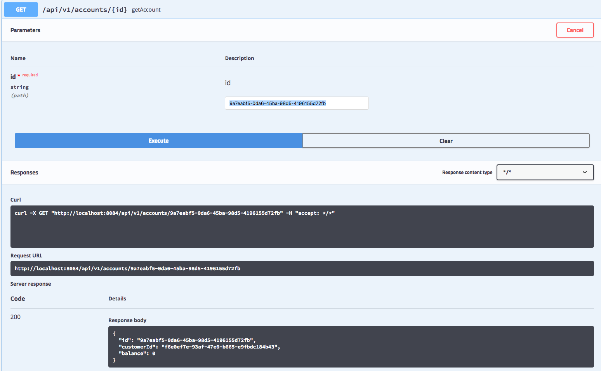
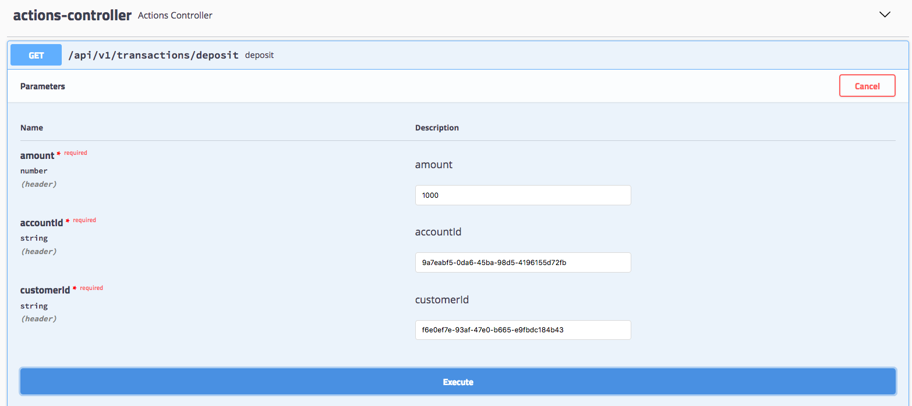

# Banking Microservices Tutorial
[](https://travis-ci.org/AITestingOrg/banking-microservices-example)
[](https://coveralls.io/github/AITestingOrg/banking-microservices-example?branch=master)

The Banking Microservices Example project is a small system used to show how microservices can be implemented and tested with Micronaut, Consul, Tyk, and Axon's Event Sourcing framework. The system can be run in multiple configurations using Docker.


## Architecture

<p style="text-align: center;">Figure 1: Overall Banking Example architecture.</p>


<p style="text-align: center;">Figure 2: Flow of communication between domain architectures.</p> 

## Configuration
The services can be configured in three ways, a local default configuration under each project resources/application.yml, a development coniguration under
resources/application-dev.yml, and the centralized configuration service.

## Requirements
See each services readme for detailed requirement information

### Compose
* https://docs.docker.com/compose/install/
* /data/db directory created and accessible to "everyone"

### Java 8
* https://www.oracle.com/technetwork/java/javase/downloads/jdk8-downloads-2133151.html

### Lombok
* IntelliJ IDEA installation: https://projectlombok.org/setup/intellij

# Running the Project

## Start the Microservices
** Build JARs for each project (You will need to build a JAR anytime changes are made to a project, then rebuild either the container or all containers)
```bash
# Assemble the binaries
./gradlew assemble
# Start the backing services: service discovery, configuration, authentication, edge service
docker-compose -f docker-compose-backing.yml up
# After the backing services have succesfully loaded, start the domain services
docker-compose up
```

## Start the Microservices with ELK Stack
```bash
# Assemble the binaries
gradle assemble
# Start the backing services: service discovery, configuration, authentication, edge service
docker-compse -f docker-compose-backing.yml up
# While the backing services are starting, start the ELK stack, note you will need to also follow the ELK steps below
docker-compose -f elk/docker-compose.yml up
# Once all the supporting services are loaded, start the domain services configured to log to ELK
docker-compose -f docker-compose-elk.yml up
```

## Stop the Containers
```bash
docker-compose down
docker-compose -f docker-compose-elk.yml down
docker-compose -f docker-compose-backing.yml down

```

## Rebuild Containers
```bash
docker-compose build
```

# Executing Tests

## Running Unit and Integration Tests
The Gradle task 'test' executes the JUnit tests for each project.
```bash
sh run-unit-tests.sh
```

## Running Code Coverage: Unit and Integration Tests
JaCoCo is used for code coverage and can be run after the unit and integraiton tests for each service have been executed.
You can find a JaCoCo coverage report under the "coverage" in transaction service after running the unit tests.

## Running Contract Tests
Start the domain services with internal mocks so that only the endpoints will be tested.

```bash
docker-compose -f docker-compose-internal-mocked.yml up -d
```
Start the PactBroker service and check `http://localhost:8089` that it is live.
```bash
docker-compose -f ./pact-broker/docker-compose.yml up -d
```
Generate the PACTs and execute them.
```bash
sh ./scripts/generate-publish-pact-tests.sh
sh ./scripts/run-pact-tests.sh
```
Stop the PactBroker.
```bash
docker-compose -f ./pact-broker/docker-compose.yml down
```
Stop the services with internal mocks.
```bash
docker-compose -f docker-compose-internal-mocked.yml down
```

## Running Service Isolation Tests

### Running Service Isolation Tests with All External Dependencies Mocked
Mocking all external dependencies to the services allows for very rapid execution of tests and alleviates the need for configuring or utilizing resources for the external dependencies.

Docker is not required to run these tests as all external dependencies are mocked.
```bash
sh isolation-test-mocked.sh
```

### Running Service Isolation Tests with External Dependencies
Here only the calls to other services are mocked, but external dependencies like databases, caches, and discovery services are deployed.

Start the external dependencies with Docker Compose.
```bash
docker-compose -f docker-compose-backing.yml up
```
Execute the tests in a new terminal once external dependencies have started.
```bash
sh isolation-test.sh
```
Tear down the external dependencies.
```bash
docker-compose -f docker-compose-backing.yml down
```

## Running Service Integration Tests
Coming soon


# API Documentation:

These request can be done using an application like postman or insomnia, directly with curl or using the provided swagger UI.
Go to the [swagger](http://localhost:8082/swagger-ui.html) for the port that customer application is running. By default, it is 8082 but it can be changed in the docker-compose files.



From there click on the customer-controller drop down, expand the post endpoint and click the try it out button:


Then a body can be provided to make a request to the service, here is an example valid body, feel free to put your name here:
```json
{
     "firstName": "John",
     "id": "f6e0ef7e-93af-47e0-b665-e9fbdc184b43",
     "lastName": "Doe"
}
```

Then click on the execute button



And scroll down to see what the response was:


Now to create some accounts for this user: 

Go to the ui for account-cmd, running on 8089. And open account-controller post [endpoint](http://localhost:8089/swagger-ui.html#/account-controller/addAccountUsingPOST)

Put the previous customerId in the body for the request and execute it. 


The response should have the generated Id for the account just created. 
Copy it somewhere, then execute again and copy the second account id too, both will be used for transactions in a moment.

First quickly check the accounts got created checking the [account query side](http://localhost:8084/swagger-ui.html#/account-controller/getAccountUsingGET)

Check the two account ids against the get endpoint, they return a 200 response with the account info and balances of 0.


Now, making some transactions lets first make a [deposit](http://localhost:8086/swagger-ui.html#/actions-controller/depositUsingGET)

Provide an amount along with the previous obtained ids for account and customer. This will respond with a transaction id that is not important for now. 


If the same account is now check on the account query side the balance should shown as the deposited account.

Now, going to the transfer endpoint and making a transaction to pass some of that balance to the other account


Check that the response was a 200 and the balances changed

## Running with Centralized Logging (ELK stack)
To run with centralized logging and logging visualizations follow the steps below.

### Start the ELK stack
* `cd elk`
* `docker-compose up` wait for everything to start
* Check that http://localhost:5601 is accessible in your browser, you can read about configuration Kibana here https://www.elastic.co/guide/en/kibana/4.0/setup.html
* `cd ../`
* `docker-compose up -f docker-compose-elk.yml`
* Refresh Kibana to see the logs.


### Micronaut Isolation test configs
`MICRONAUT_ENVIRONMENTS=test,mock` 
