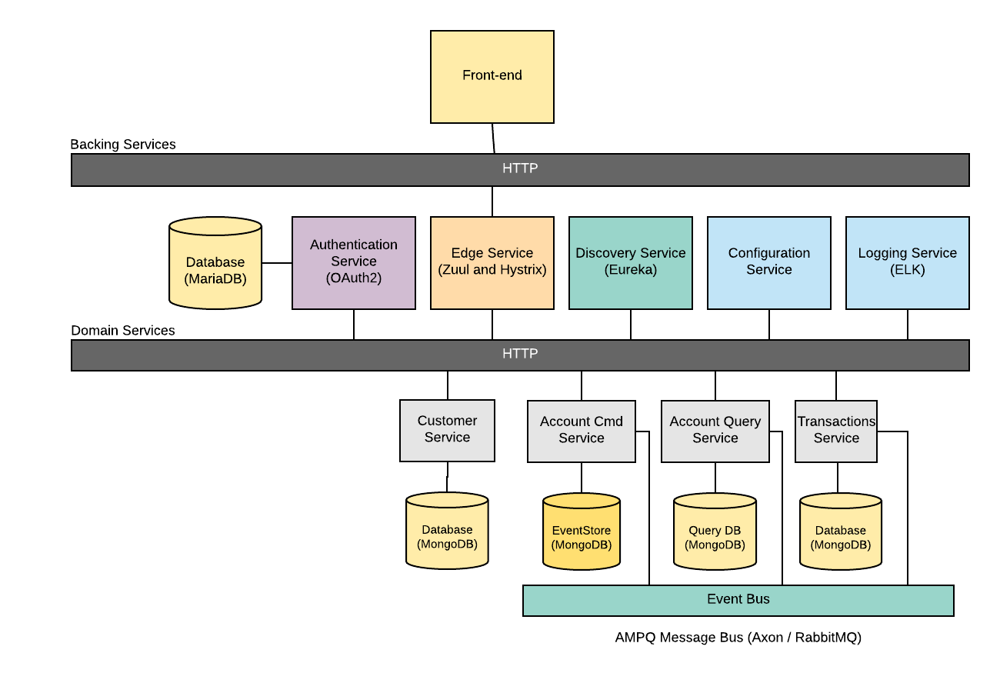
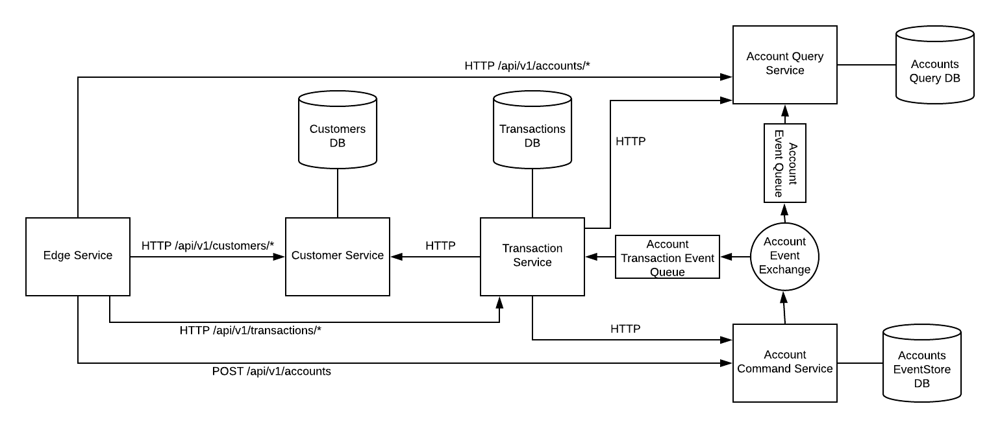

# Banking Microservices Example
[](https://travis-ci.org/AITestingOrg/banking-microservices-example)

The Banking Microservices Example project is a small system used to show how microservices can be implemented with Netflix's Zuul / Eureka framework and Axon's Event Sourcing framework. The system can be run in multiple configurations using Docker.

## Architecture

<p style="text-align: center;">Figure 1: Overall Banking Example architecture.</p>


<p style="text-align: center;">Figure 2: Flow of communication between domain architectures.</p>

## Configuration
The services can be configured in three ways, a local default configuration under each project resources/application.yml, a development coniguration under
resources/application-dev.yml, and the centralized configuration service.

## Requirements
See each services readme for detailed requirement information

### Compose
* https://docs.docker.com/compose/install/
* /data/db directory created and accessible to "everyone"

## Start the Microservices
** Build JARs for each project (You will need to build a JAR anytime changes are made to a project, then rebuild either the container or all containers)
```bash
# Assemble the binaries
gradle assemble
# Start the backing services: service discovery, configuration, authentication, edge service
docker-compse -f docker-compose-dev.yml up
# After the backing services have succesfully loaded, start the domain services
docker-compose up
```

## Start the Microservices with ELK Stack
```bash
# Assemble the binaries
gradle assemble
# Start the backing services: service discovery, configuration, authentication, edge service
docker-compse -f docker-compose-dev.yml up
# While the backing services are starting, start the ELK stack, note you will need to also follow the ELK steps below
docker-compose -f elk/docker-compose.yml up
# Once all the supporting services are loaded, start the domain services configured to log to ELK
docker-compose -f docker-compose-elk.yml up
```

## Stop the Containers
```bash
docker-compose down
docker-compose -f docker-compose-elk.yml down
docker-compose -f docker-compose-dev.yml down

```

## Rebuild Containers
```bash
docker-compose build
```

## Running with Centralized Logging (ELK stack)
To run with centralized logging and logging visualizations follow the steps below.

### Start the ELK stack
* `cd elk`
* `docker-compose up` wait for everything to start
* Check that http://localhost:5601 is accessible in your browser, you can read about configuration Kibana here https://www.elastic.co/guide/en/kibana/4.0/setup.html
* `cd ../`
* `docker-compose up -f docker-compose-elk.yml`
* Refresh Kibana to see the logs.

